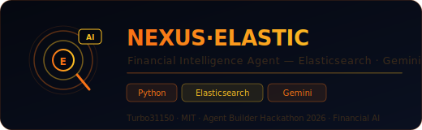
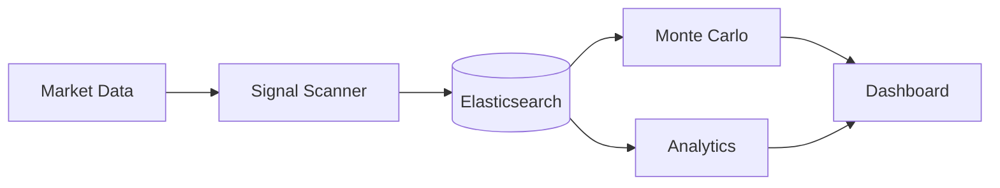

<div align="center">
  
  <br/><br/>

  [](LICENSE)
  [](#)
  [](#)
  [](#)
  [](#)

  <br/>
  <p><strong>Agent d'intelligence financière autonome · Elasticsearch vector search · Gemini · Agent Builder Hackathon 2026</strong></p>
  <p><em>Analyse financière IA propulsée par Elasticsearch — search vectoriel, RAG financier, agent autonome</em></p>
</div>

---


## Architecture



## Présentation

**NEXUS·ELASTIC** est un agent d'intelligence financière construit pour l'**Agent Builder Hackathon 2026**. Il combine Elasticsearch (vector search + full-text) avec Gemini pour créer un assistant financier capable d'analyser des marchés, rechercher des patterns historiques, et générer des recommandations basées sur des données vectorisées.

---

## Architecture

```
NEXUS·ELASTIC — Agent financier
─────────────────────────────────────────────
  Market Data Feed
       │
       ▼
  Elasticsearch Index       Vector + full-text
  (données financières)     Embeddings Gemini
       │
       ▼
  RAG Pipeline              Retrieval-Augmented
  retrieve_context()        Generation
       │
       ▼
  Gemini Agent              Analyse + décision
  financial_analyst()       Recommandations
       │
       ▼
  Output: Report + Signals
```

---

## Stack

| Composant | Technologie |
|-----------|-------------|
| **Search** | Elasticsearch 8.x |
| **Embeddings** | Gemini text-embedding |
| **LLM** | Gemini Pro / Flash |
| **Framework** | Agent Builder (Google Cloud) |
| **API** | FastAPI + WebSocket |
| **DB** | Elasticsearch + SQLite |

---

## Installation

```bash
git clone https://github.com/Turbo31150/TradeOracle-Nexus-Elastic.git
cd TradeOracle-Nexus-Elastic
pip install -r requirements.txt
cp .env.example .env
# GOOGLE_API_KEY=... · ELASTICSEARCH_URL=...
python main.py
```


## What is TradeOracle Nexus?

The **analytics and intelligence layer** of TradeOracle. While TradeOracle makes trading decisions in real-time, Nexus stores everything in Elasticsearch for deep analysis later.

Think of it as the "memory" of the trading system — every signal, every trade, every market condition is indexed and searchable. Monte Carlo simulations run thousands of scenarios to stress-test strategies.

## How It Works

```
1. TradeOracle generates signals → stored in Elasticsearch
2. Nexus indexes: price, volume, signal type, confidence, result
3. Monte Carlo runs 10,000 simulations on historical data
4. Dashboard shows: win rate, drawdown, Sharpe ratio, best/worst scenarios
5. Strategy auto-adjusts based on backtesting results
```

## Usage Examples

```python
# Search all BREAKOUT signals from the last 7 days
from nexus import SignalSearch
results = SignalSearch().query(
    signal_type="BREAKOUT",
    timeframe="7d",
    min_confidence=70
)
# → 23 signals found, 78% win rate, avg +3.2% profit

# Run Monte Carlo on a strategy
from nexus import MonteCarlo
mc = MonteCarlo(strategy="momentum", simulations=10000)
report = mc.run()
# → Expected annual return: 42%, Max drawdown: -12%, Sharpe: 1.8

# Dashboard query
from nexus import Dashboard
stats = Dashboard().daily_summary()
# → {trades: 15, wins: 11, losses: 4, pnl: +$234, best: SOL +8.2%}
```

## Key Features

| Feature | Description |
|---------|-------------|
| **Signal Indexing** | Every signal stored with full context (price, volume, indicators) |
| **Monte Carlo** | 10,000 simulation backtesting with confidence intervals |
| **Win Rate Tracking** | Per-signal-type, per-timeframe, per-asset statistics |
| **Drawdown Analysis** | Maximum drawdown detection and strategy adjustment |
| **Dashboard** | Real-time analytics with historical comparisons |
| **Elasticsearch** | Sub-second queries on millions of data points |

## Why Elasticsearch?

SQLite is great for local storage, but trading analytics needs **full-text search**, **aggregations**, and **real-time dashboards** on millions of records. Elasticsearch provides all three with sub-second response times.


---

<div align="center">

**Franc Delmas (Turbo31150)** · Agent Builder Hackathon 2026 · MIT License

</div>


---

## Elasticsearch Setup Guide

### Installation

```bash
# Option 1: Docker (recommended)
docker run -d --name elasticsearch \
  -p 9200:9200 -p 9300:9300 \
  -e "discovery.type=single-node" \
  -e "xpack.security.enabled=false" \
  -e "ES_JAVA_OPTS=-Xms2g -Xmx2g" \
  docker.elastic.co/elasticsearch/elasticsearch:8.12.0

# Option 2: APT (Ubuntu/Debian)
wget -qO - https://artifacts.elastic.co/GPG-KEY-elasticsearch | sudo gpg --dearmor -o /usr/share/keyrings/elasticsearch-keyring.gpg
echo "deb [signed-by=/usr/share/keyrings/elasticsearch-keyring.gpg] https://artifacts.elastic.co/packages/8.x/apt stable main" | sudo tee /etc/apt/sources.list.d/elastic-8.x.list
sudo apt update && sudo apt install elasticsearch
sudo systemctl enable --now elasticsearch

# Verify installation
curl -s http://localhost:9200 | python3 -m json.tool
```

### Configuration

Edit `/etc/elasticsearch/elasticsearch.yml`:

```yaml
# Cluster
cluster.name: tradeoracle-nexus
node.name: nexus-01

# Network
network.host: 0.0.0.0
http.port: 9200

# Memory
bootstrap.memory_lock: true

# Performance
indices.memory.index_buffer_size: 30%
thread_pool.write.queue_size: 1000

# For single-node development
discovery.type: single-node
xpack.security.enabled: false
```

JVM settings in `/etc/elasticsearch/jvm.options`:

```
# Set to 50% of available RAM, max 31g
-Xms4g
-Xmx4g
```

---

## Index Configuration

### Signal Index

The primary index for trading signals:

```json
PUT /tradeoracle-signals
{
  "settings": {
    "number_of_shards": 2,
    "number_of_replicas": 0,
    "refresh_interval": "5s",
    "index.mapping.total_fields.limit": 2000
  },
  "mappings": {
    "properties": {
      "timestamp": { "type": "date" },
      "signal_type": { "type": "keyword" },
      "asset": { "type": "keyword" },
      "direction": { "type": "keyword" },
      "confidence": { "type": "float" },
      "price_at_signal": { "type": "float" },
      "volume": { "type": "float" },
      "timeframe": { "type": "keyword" },
      "indicators": {
        "type": "object",
        "properties": {
          "rsi": { "type": "float" },
          "macd": { "type": "float" },
          "macd_signal": { "type": "float" },
          "ema_20": { "type": "float" },
          "ema_50": { "type": "float" },
          "bollinger_upper": { "type": "float" },
          "bollinger_lower": { "type": "float" },
          "atr": { "type": "float" }
        }
      },
      "result": {
        "type": "object",
        "properties": {
          "status": { "type": "keyword" },
          "pnl_percent": { "type": "float" },
          "exit_price": { "type": "float" },
          "exit_timestamp": { "type": "date" },
          "duration_minutes": { "type": "integer" }
        }
      },
      "description": { "type": "text" },
      "description_vector": {
        "type": "dense_vector",
        "dims": 768,
        "index": true,
        "similarity": "cosine"
      }
    }
  }
}
```

### Market Data Index

```json
PUT /tradeoracle-market-data
{
  "settings": {
    "number_of_shards": 3,
    "number_of_replicas": 0,
    "refresh_interval": "1s"
  },
  "mappings": {
    "properties": {
      "timestamp": { "type": "date" },
      "asset": { "type": "keyword" },
      "open": { "type": "float" },
      "high": { "type": "float" },
      "low": { "type": "float" },
      "close": { "type": "float" },
      "volume": { "type": "float" },
      "timeframe": { "type": "keyword" }
    }
  }
}
```

### Simulation Results Index

```json
PUT /tradeoracle-simulations
{
  "settings": {
    "number_of_shards": 1,
    "number_of_replicas": 0
  },
  "mappings": {
    "properties": {
      "timestamp": { "type": "date" },
      "strategy": { "type": "keyword" },
      "n_simulations": { "type": "integer" },
      "expected_return": { "type": "float" },
      "var_95": { "type": "float" },
      "max_drawdown_95": { "type": "float" },
      "sharpe_ratio": { "type": "float" },
      "win_rate": { "type": "float" },
      "parameters": { "type": "object", "enabled": false }
    }
  }
}
```

---

## Kibana Dashboard Setup

### Installation

```bash
# Docker
docker run -d --name kibana \
  -p 5601:5601 \
  -e "ELASTICSEARCH_HOSTS=http://elasticsearch:9200" \
  docker.elastic.co/kibana/kibana:8.12.0

# Access at http://localhost:5601
```

### Dashboard Panels

#### Panel 1: Signal Overview (Pie Chart)

```json
// Saved search: Signal distribution by type
GET /tradeoracle-signals/_search
{
  "size": 0,
  "aggs": {
    "by_type": {
      "terms": { "field": "signal_type", "size": 20 }
    }
  }
}
```

#### Panel 2: Win Rate Over Time (Line Chart)

```json
GET /tradeoracle-signals/_search
{
  "size": 0,
  "query": { "exists": { "field": "result.status" } },
  "aggs": {
    "by_day": {
      "date_histogram": { "field": "timestamp", "calendar_interval": "day" },
      "aggs": {
        "wins": {
          "filter": { "term": { "result.status": "win" } }
        },
        "win_rate": {
          "bucket_script": {
            "buckets_path": { "wins": "wins._count", "total": "_count" },
            "script": "params.total > 0 ? params.wins / params.total * 100 : 0"
          }
        }
      }
    }
  }
}
```

#### Panel 3: P&L Cumulative (Area Chart)

```json
GET /tradeoracle-signals/_search
{
  "size": 0,
  "query": { "exists": { "field": "result.pnl_percent" } },
  "aggs": {
    "by_day": {
      "date_histogram": { "field": "timestamp", "calendar_interval": "day" },
      "aggs": {
        "daily_pnl": { "sum": { "field": "result.pnl_percent" } },
        "cumulative_pnl": {
          "cumulative_sum": { "buckets_path": "daily_pnl" }
        }
      }
    }
  }
}
```

#### Panel 4: Top Assets by Volume (Bar Chart)

```json
GET /tradeoracle-signals/_search
{
  "size": 0,
  "aggs": {
    "by_asset": {
      "terms": { "field": "asset", "size": 10, "order": { "total_volume": "desc" } },
      "aggs": {
        "total_volume": { "sum": { "field": "volume" } },
        "avg_confidence": { "avg": { "field": "confidence" } }
      }
    }
  }
}
```

---

## Alert Rules

### Elasticsearch Watcher Configuration

#### Alert 1: Drawdown Warning

```json
PUT _watcher/watch/drawdown_alert
{
  "trigger": { "schedule": { "interval": "5m" } },
  "input": {
    "search": {
      "request": {
        "indices": ["tradeoracle-signals"],
        "body": {
          "size": 0,
          "query": {
            "range": { "timestamp": { "gte": "now-24h" } }
          },
          "aggs": {
            "total_pnl": { "sum": { "field": "result.pnl_percent" } }
          }
        }
      }
    }
  },
  "condition": {
    "compare": { "ctx.payload.aggregations.total_pnl.value": { "lt": -5.0 } }
  },
  "actions": {
    "notify": {
      "webhook": {
        "method": "POST",
        "url": "http://localhost:8080/api/alerts",
        "body": "{"type": "drawdown", "value": "{{ctx.payload.aggregations.total_pnl.value}}%", "priority": "critical"}"
      }
    }
  }
}
```

#### Alert 2: Low Win Rate

```json
PUT _watcher/watch/winrate_alert
{
  "trigger": { "schedule": { "interval": "1h" } },
  "input": {
    "search": {
      "request": {
        "indices": ["tradeoracle-signals"],
        "body": {
          "size": 0,
          "query": {
            "bool": {
              "must": [
                { "range": { "timestamp": { "gte": "now-7d" } } },
                { "exists": { "field": "result.status" } }
              ]
            }
          },
          "aggs": {
            "total": { "value_count": { "field": "result.status" } },
            "wins": { "filter": { "term": { "result.status": "win" } } }
          }
        }
      }
    }
  },
  "condition": {
    "script": {
      "source": "return ctx.payload.aggregations.total.value > 10 && (ctx.payload.aggregations.wins.doc_count / ctx.payload.aggregations.total.value) < 0.5"
    }
  },
  "actions": {
    "notify": {
      "webhook": {
        "method": "POST",
        "url": "http://localhost:8080/api/alerts",
        "body": "{"type": "low_winrate", "priority": "high"}"
      }
    }
  }
}
```

---

## Backtesting Methodology

### How Backtests Work

```
1. Select strategy and time period
2. Replay historical data chronologically
3. At each candle, run the strategy's signal detection
4. If signal generated: record entry price, confidence, indicators
5. Apply exit rules (stop-loss, take-profit, time-based)
6. Record result: win/loss, P&L, duration
7. Calculate aggregate statistics
```

### Key Metrics

| Metric | Formula | Good Value |
|--------|---------|-----------|
| **Win Rate** | wins / total_trades | > 55% |
| **Profit Factor** | gross_profit / gross_loss | > 1.5 |
| **Sharpe Ratio** | mean_return / std_return * sqrt(252) | > 1.0 |
| **Max Drawdown** | max peak-to-trough decline | < 15% |
| **Expectancy** | (win_rate * avg_win) - (loss_rate * avg_loss) | > 0 |
| **Recovery Factor** | total_profit / max_drawdown | > 3.0 |
| **Calmar Ratio** | annual_return / max_drawdown | > 2.0 |

### Backtest Example

```python
from nexus import Backtester

bt = Backtester(
    strategy="momentum",
    start_date="2025-01-01",
    end_date="2026-03-27",
    initial_capital=10000,
    assets=["BTC/USDT", "ETH/USDT", "SOL/USDT"],
    timeframe="1h"
)

results = bt.run()

print(f"Total trades:   {results.total_trades}")
print(f"Win rate:       {results.win_rate:.1%}")
print(f"Profit factor:  {results.profit_factor:.2f}")
print(f"Sharpe ratio:   {results.sharpe_ratio:.2f}")
print(f"Max drawdown:   {results.max_drawdown:.1%}")
print(f"Total P&L:      ${results.total_pnl:,.2f}")
print(f"Best trade:     {results.best_trade}")
print(f"Worst trade:    {results.worst_trade}")
```

---

## Performance Benchmarks

| Operation | Latency | Throughput |
|-----------|---------|-----------|
| Index 1 signal | < 5ms | 200/sec |
| Search signals (keyword) | < 10ms | 500 queries/sec |
| Search signals (vector) | < 50ms | 100 queries/sec |
| Aggregation (daily stats) | < 100ms | - |
| Monte Carlo (10K sims) | 3-5s | - |
| Full backtest (1 year, 3 assets) | 15-30s | - |
| Dashboard refresh | < 500ms | - |

### Index Size Estimates

| Data Type | Records/Day | Size/Day | Size/Year |
|-----------|------------|----------|----------|
| Signals | 50-200 | 1-5 MB | 400 MB - 1.8 GB |
| Market data (1m candles) | 4,320/asset | 10-50 MB | 3.6 - 18 GB |
| Simulations | 5-20 | 1-5 MB | 400 MB - 1.8 GB |

---

## Data Retention Policy

| Index | Hot (SSD) | Warm (HDD) | Delete |
|-------|-----------|------------|--------|
| `tradeoracle-signals` | 30 days | 1 year | After 2 years |
| `tradeoracle-market-data` | 7 days | 3 months | After 1 year |
| `tradeoracle-simulations` | 90 days | 1 year | After 3 years |

### ILM (Index Lifecycle Management) Policy

```json
PUT _ilm/policy/tradeoracle-policy
{
  "policy": {
    "phases": {
      "hot": {
        "min_age": "0ms",
        "actions": {
          "rollover": { "max_size": "5gb", "max_age": "30d" }
        }
      },
      "warm": {
        "min_age": "30d",
        "actions": {
          "shrink": { "number_of_shards": 1 },
          "forcemerge": { "max_num_segments": 1 }
        }
      },
      "delete": {
        "min_age": "730d",
        "actions": { "delete": {} }
      }
    }
  }
}
```


Part of [JARVIS OS](https://github.com/Turbo31150/jarvis-linux) ecosystem.
