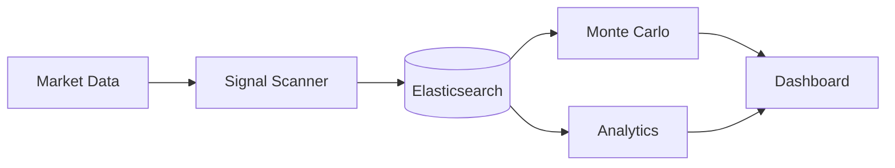

<div align="center">
  
  <br/><br/>

  [](LICENSE)
  [](#)
  [](#)
  [](#)
  [](#)

  <br/>
  <p><strong>Agent d'intelligence financière autonome · Elasticsearch vector search · Gemini · Agent Builder Hackathon 2026</strong></p>
  <p><em>Analyse financière IA propulsée par Elasticsearch — search vectoriel, RAG financier, agent autonome</em></p>
</div>

---


## Architecture



## Présentation

**NEXUS·ELASTIC** est un agent d'intelligence financière construit pour l'**Agent Builder Hackathon 2026**. Il combine Elasticsearch (vector search + full-text) avec Gemini pour créer un assistant financier capable d'analyser des marchés, rechercher des patterns historiques, et générer des recommandations basées sur des données vectorisées.

---

## Architecture

```
NEXUS·ELASTIC — Agent financier
─────────────────────────────────────────────
  Market Data Feed
       │
       ▼
  Elasticsearch Index       Vector + full-text
  (données financières)     Embeddings Gemini
       │
       ▼
  RAG Pipeline              Retrieval-Augmented
  retrieve_context()        Generation
       │
       ▼
  Gemini Agent              Analyse + décision
  financial_analyst()       Recommandations
       │
       ▼
  Output: Report + Signals
```

---

## Stack

| Composant | Technologie |
|-----------|-------------|
| **Search** | Elasticsearch 8.x |
| **Embeddings** | Gemini text-embedding |
| **LLM** | Gemini Pro / Flash |
| **Framework** | Agent Builder (Google Cloud) |
| **API** | FastAPI + WebSocket |
| **DB** | Elasticsearch + SQLite |

---

## Installation

```bash
git clone https://github.com/Turbo31150/TradeOracle-Nexus-Elastic.git
cd TradeOracle-Nexus-Elastic
pip install -r requirements.txt
cp .env.example .env
# GOOGLE_API_KEY=... · ELASTICSEARCH_URL=...
python main.py
```


## What is TradeOracle Nexus?

The **analytics and intelligence layer** of TradeOracle. While TradeOracle makes trading decisions in real-time, Nexus stores everything in Elasticsearch for deep analysis later.

Think of it as the "memory" of the trading system — every signal, every trade, every market condition is indexed and searchable. Monte Carlo simulations run thousands of scenarios to stress-test strategies.

## How It Works

```
1. TradeOracle generates signals → stored in Elasticsearch
2. Nexus indexes: price, volume, signal type, confidence, result
3. Monte Carlo runs 10,000 simulations on historical data
4. Dashboard shows: win rate, drawdown, Sharpe ratio, best/worst scenarios
5. Strategy auto-adjusts based on backtesting results
```

## Usage Examples

```python
# Search all BREAKOUT signals from the last 7 days
from nexus import SignalSearch
results = SignalSearch().query(
    signal_type="BREAKOUT",
    timeframe="7d",
    min_confidence=70
)
# → 23 signals found, 78% win rate, avg +3.2% profit

# Run Monte Carlo on a strategy
from nexus import MonteCarlo
mc = MonteCarlo(strategy="momentum", simulations=10000)
report = mc.run()
# → Expected annual return: 42%, Max drawdown: -12%, Sharpe: 1.8

# Dashboard query
from nexus import Dashboard
stats = Dashboard().daily_summary()
# → {trades: 15, wins: 11, losses: 4, pnl: +$234, best: SOL +8.2%}
```

## Key Features

| Feature | Description |
|---------|-------------|
| **Signal Indexing** | Every signal stored with full context (price, volume, indicators) |
| **Monte Carlo** | 10,000 simulation backtesting with confidence intervals |
| **Win Rate Tracking** | Per-signal-type, per-timeframe, per-asset statistics |
| **Drawdown Analysis** | Maximum drawdown detection and strategy adjustment |
| **Dashboard** | Real-time analytics with historical comparisons |
| **Elasticsearch** | Sub-second queries on millions of data points |

## Why Elasticsearch?

SQLite is great for local storage, but trading analytics needs **full-text search**, **aggregations**, and **real-time dashboards** on millions of records. Elasticsearch provides all three with sub-second response times.


---

<div align="center">

**Franc Delmas (Turbo31150)** · Agent Builder Hackathon 2026 · MIT License

</div>


Part of [JARVIS OS](https://github.com/Turbo31150/jarvis-linux) ecosystem.
